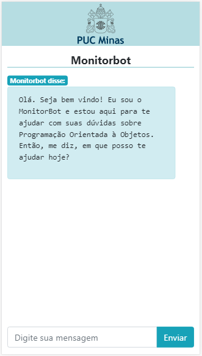

# MonitorBot

## Projeto criado para desenvolvimento do Trabalho de Conclusão de Curso, do curso de Sistemas de Informação, da PUC Minas.

> O Chatbot foi desenvolvido utilizando o IBM Watson Assistant, NodeJS e ReactJS. O Chatbot funciona em uma página web (app-monitorbot.herokuapp.com) e também como uma PWA, podendo ser adicionado à tela inicial dos smartphones. 

  

